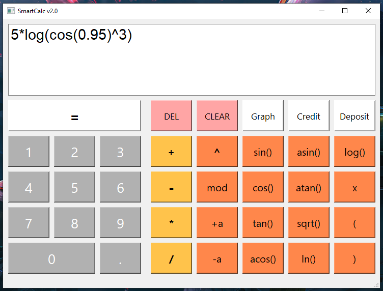
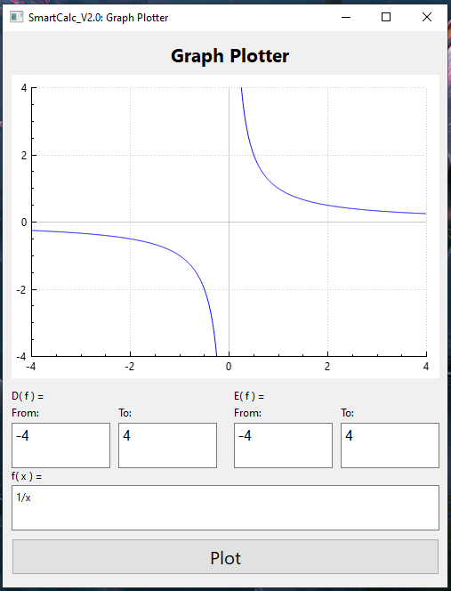
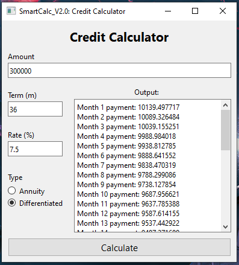

# CPP_SmartCalc_v2.0
🧮➕➖ Implemention of extended version of the usual calculator.

The calculation principle is based on the Reverse Polish Notation and the Dijkstra's algorithm.

## Install:
1. Go to /src
2. Do ```make install```
3. Run from Desctop icon (or find and run executable in ${PWD}/s21_smart_calc/)

## Overview:







